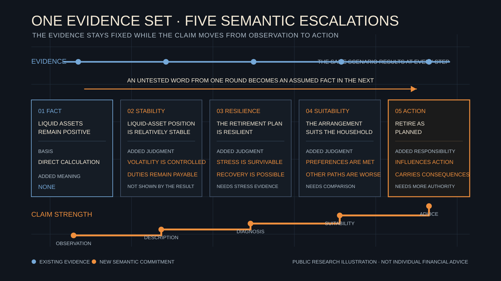

# The Adjective Death Spiral

[简体中文](adjective-death-spiral.zh-CN.md)

> Governance Kernel in this article describes a future WhiteBox research and product direction, not an existing production capability.

Several lines of language-model research point to neighboring problems. Models may agree with a user's stated view, alter meaning during summarization and rewriting, or produce confident prose without adequate factual support. WhiteBox's “adjective death spiral” is our own working concept, not an established academic term.

It describes a small but consequential change. The facts remain fixed while the words used to describe them become progressively stronger. Each rewrite sounds smoother. By the end, the sentence carries far more professional responsibility than the original evidence can support.

## How One Sentence Becomes Stronger

Consider a fictional household. Mr. Chen is 52 and hopes to retire at 58. The family has CNY 2.4 million in accessible financial assets. His child will enter university around the retirement transition, and the mortgage has nine years remaining. Income, education costs, mortgage payments, and retirement cash flow are placed into several illustrative scenarios. The figures and five rewrites below are constructed examples, not records from an experiment on a particular model.

The initial result establishes one limited point. Under the current assumptions, liquid assets remain positive from age 58 to 62 in the base scenario. A stress scenario shows that a one-year interruption to household income would bring accessible assets closer to the family's stated minimum reserve.

The first summary says that liquid assets remain positive during the early retirement period. That sentence can be traced directly to the result.

The second says that the household's liquid-asset position in early retirement is “relatively stable.” Stability adds meaning. It may imply that volatility is manageable or that the household can continue meeting its responsibilities. The original result does not answer either question.

The third says that the retirement plan is “resilient.” The scope has expanded again. Resilience normally requires examining the severity of stress, the path to recovery, and the choices that remain available. A positive number in one base scenario cannot carry all of that weight.

The fourth says that the retirement arrangement is “suitable” for the Chen household. Suitability introduces household preferences, care responsibilities, and comparison with other available paths. None has been added to the evidence.

The fifth says that the household should retire as planned.

The numbers never changed. The adjectives increased the force of the judgment, and the scope then expanded. Each sentence inherited the previous adjective as though it were an established fact, then moved one step further. A local observation from a base scenario ended as a recommendation capable of influencing household action.

That is what this article calls the adjective death spiral.

## Why Fluency Raises the Stakes

Fluency has genuine value. Professional material that nobody can understand will not support meaningful review. Risk appears when fluent language hides a missing evidentiary step.

Sycophancy can make this worse. Sharma and colleagues tested five then state-of-the-art AI assistants and found consistent sycophantic behavior across several free-form text-generation tasks. Their study also found that human raters and preference models sometimes favored convincingly written answers that matched a user's view. If a user begins with “this retirement plan seems resilient,” a model may be drawn toward organizing the available material around that label instead of asking what evidence resilience would require.

Repeated transmission also deserves attention. Acharjee and colleagues studied 700 five-step information chains to examine semantic drift and the accumulation of hallucinations. Their findings do not support the absolute claim that every rewrite makes text worse. The paper specifically reports that meaning was often preserved when a human-written summary was refined by a model. The more careful lesson is that fidelity after several rewrites must be checked independently; it cannot be inferred from the apparent quality of the prose.

Models may also contain useful signals about their own uncertainty. Kadavath and colleagues found that larger language models could evaluate aspects of answer correctness with encouraging calibration when questions were presented in suitable formats. Calibration remained difficult when models judged whether they knew the answers to unfamiliar tasks. This suggests a constructive path. Model capability can help surface uncertainty, while external evidence and governance remain necessary.

These three studies concern sycophancy, information fidelity across repeated transmission, and self-evaluation under particular conditions. They do not directly validate the adjective death spiral or GK. They establish neighboring risks; the concept and governance proposal in this article still require separate testing.

## A Counterexample That Prevents Overcorrection

Now return to the Chen household.

Suppose a stronger model notices that university costs, the retirement-income transition, and continuing mortgage payments all overlap from age 58 to 61. Scenario results also show that accessible assets decline most quickly in that window. A paired scenario then moves the same education costs to after age 62 while holding the other assumptions fixed. The decline from age 58 to 61 becomes materially smaller. Suppose the existing rule library contains no prewritten relationship of this kind. The model connects the results for the first time and proposes a statement.

Under the current scenario, education costs and the retirement transition overlap in time. That overlap may be one source of early-retirement liquidity pressure.

This is a new insight. It goes beyond repeating that assets remain positive, yet it stays within the evidence. The overlap can be checked, and the paired scenario supports treating it as a contributor to pressure. “One source” leaves room for other explanations, and the statement remains bounded to the current scenario.

A governance system built as a whitelist of known conclusions would reject the statement. WhiteBox would then lose much of the value of stronger models. As model capability improves, models may identify relationships, anomalies, and counterexamples that designers did not anticipate. Requiring every insight to appear first as a human-authored rule would confine the system to repeating what was already known.

This counterexample locates the future role of GK. GK does not need to decide whether a sentence belongs to a known answer set. It needs to inspect the strength of the language, whether the evidence supports that strength, whether the scope exceeds the current scenario, and whether material counterevidence has been ignored.

## Constraining Commitment While Preserving Intelligence

WhiteBox is exploring GK as a professional commitment boundary. Models should remain free to propose unfamiliar and even counterintuitive insights. Before WhiteBox adopts a statement as its own, the system should identify its basis and scope. It should also establish who is responsible for the statement and whether the supporting facts remain valid.

The smallest principle is concise.

> The authority carried by a claim must not exceed what its evidence supports.

Here, authority describes how much certainty and scope a claim may carry into professional output.

This principle does not search for insights or provide predetermined answers. It prevents a conditional result from quietly becoming a certain future or a local observation from becoming a judgment about the whole plan. A contributing factor should not become the main cause without comparison.

When a model can organize facts, interpretations, and action language more fluently, an unsupported escalation becomes harder for readers to notice. GK must therefore develop alongside model capability while leaving room for that capability to discover something new.

WhiteBox currently treats this as a future research direction. Public, reproducible cases will be needed to test how much professional force different adjectives carry and what evidence can support that force. Further cases should test whether governance can preserve the value of a novel insight.

This article is for public education and research discussion only. It is not investment, insurance, tax, or individualized financial advice.

## Public References

- [Research on sycophancy in language models](https://arxiv.org/abs/2310.13548)
- [Research on information fidelity in human-AI chains](https://aclanthology.org/2025.ijcnlp-long.146/)
- [Research on language-model self-evaluation and calibration](https://arxiv.org/abs/2207.05221)
