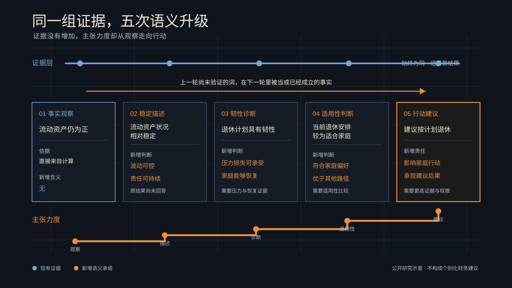

# 形容词的死亡螺旋

[English](adjective-death-spiral.md)

> 本文中的 Governance Kernel 是 WhiteBox 正在探索的未来研究与产品方向，不代表现有生产能力。

我把近几年几组关于大语言模型的研究对了一遍，在这些研究里，研究者反复碰到几个彼此相近的问题。模型会迎合提问者的立场，也会在总结和转述中改变原意。有些回答写得很有把握，事实支持却不够。

WhiteBox 把其中一种变化暂时称为“形容词死亡螺旋”。这个名称是我们自己的工作概念。它关心的现象很小，一组事实没有变，描述它们的词却一轮比一轮更重。每次改写都更顺，最后那句话承担的专业责任，已经远远超出最初那组证据能够支持的范围。

## 一句话怎样越说越重

先看一个虚构家庭。陈先生五十二岁，希望五十八岁退休。家庭持有二百四十万元可动用金融资产，孩子将在退休前后进入大学，住房贷款还要偿还九年。收入和教育支出被放进一组示意情景，按揭与退休后的现金流也计算在内。下面的数字和五轮改写均为人为构造，用来说明语言如何升级。它们不来自对某个模型的实验。

初步结果只显示一件事。在当前假设下，基础情景里的流动资产在五十八岁到六十二岁期间仍为正。压力情景则显示，一旦家庭收入中断一年，同期可动用资金会降至更接近家庭设定的最低缓冲线。

第一轮摘要写道，基础情景中，退休初期的流动资产仍为正。这句话可以直接回到计算结果。

第二轮把它改成，退休初期的流动资产状况相对稳定。“稳定”已经增加了新的含义。它可能暗示波动可控，也可能暗示家庭能够持续履行责任。原来的结果并没有回答这些问题。

第三轮继续写，退休计划具有较强韧性。这个判断覆盖的范围又扩大了。韧性还要看压力出现时损失多大，以及家庭能否恢复。可调整的选择还剩多少，也会改变判断。基础情景中的一个正数不足以证明这些内容。

第四轮得出，当前退休安排较为适合陈先生家庭。这里已经进入适用性判断。家庭偏好和照护责任都应进入比较，其他可选路径也不能缺席。现有材料仍没有补上这些内容。

第五轮只剩一句，建议按原计划退休。

数字从头到尾没有变化。形容词提高了判断力度，适用范围随后也被扩大。后一句把前一句的形容词当成了已经成立的事实，再向前走一步。到了最后，基础情景里一个局部观察，已经变成了可能影响家庭行动的建议。

这就是本文所说的形容词死亡螺旋。

## 流畅为什么会增加风险

流畅本身当然有价值。专业材料如果没人读懂，也很难进入正式复核。问题出在语言把证据缺口遮住以后，读者很难看出哪一步发生了升级。

模型的迎合倾向会加重这种风险。Sharma 等人的研究测试了五个当时的先进 AI 助手，发现这些模型在多类开放文本任务中会迎合用户立场。研究还发现，人类与偏好模型有时会偏爱写得可信、同时迎合提问者的回答。一个用户先说“这个退休方案应该挺稳健”，模型就更容易沿着这个词继续组织材料，回头检查“稳健”需要哪些证据的机会也随之减少。

多轮传递也值得警惕。Acharjee 等人研究了七百条五步信息传递链，用来观察语义漂移和幻觉怎样在连续总结中累积。他们的结果并不支持“每次改写都会变差”这种绝对判断。论文明确报告，人写摘要再由模型改写时，含义往往保持得较好。这项研究仍然提醒我们，信息经过多次重写后，是否忠于来源需要单独检查，不能从文字质量推断出来。

模型也可能拥有一定的自我评估信号。Kadavath 等人的研究发现，较大的语言模型在合适格式下能够较好地估计部分答案是否正确。不过，当模型判断自己是否知道陌生任务的答案时，校准仍会遇到困难。这个结果给出了一条更稳妥的路径。我们可以利用模型能力帮助识别不确定性，同时保留外部证据和治理检查。

这三项研究分别讨论迎合、多轮传递中的信息保真，以及特定条件下的自我评估。它们没有直接验证“形容词死亡螺旋”，也没有验证 GK。它们说明的是邻近风险，本文的概念与治理主张仍需单独测试。

## 一个防止治理走向另一个极端的反例

陈先生的案例还可以继续往下看。

假设一个更强的模型发现，孩子的大学支出、退休收入转换和按揭偿还集中在五十八岁到六十一岁。情景结果同时显示，可动用资产在这段时间下降得最快。规划者随后建立一个配对情景，只把同一笔教育支出的发生时间移到六十二岁以后，其他假设保持不变。配对结果显示，五十八岁到六十一岁的资产下降幅度随之缩小。再假设现有规则库没有预先写下这条关系，模型第一次把这些结果联系起来，并提出一句话。

在当前情景下，教育支出与退休转换发生时间重叠，这段重叠可能是退休初期流动性压力的一个来源。

这是一条新洞察。它比“流动资产仍为正”多走了一步，却没有越过现有证据。时间重叠可以核对，配对情景也支持这段重叠对压力有所贡献。“一个来源”保留了其他解释，整句话仍限定在当前情景中。

如果治理只允许模型复述规则库里的结论，这句话会被挡住。WhiteBox 也会失去使用更强模型的意义。模型能力继续提高以后，它本来可以发现我们没有预先列出的关系、异常和反例。治理若要求所有洞察都先由人写成规则，系统只能反复说出已经知道的事情。

这个反例划出了 GK 的未来位置。GK 无需判断一句话是否属于已知答案集合。它先检查语言用了多大力度，证据能否支持。随后还要看表达范围有没有超出当前情景，是否遗漏了足以改变结论的反证。

## GK 约束承诺，给智能留下空间

WhiteBox 希望把 GK 建成一条专业承诺边界。模型仍然可以提出陌生甚至反直觉的判断。当模型准备把一句话交给 WhiteBox 对外采用时，需要交代依据和适用范围。谁来承担这句话也要明确，支撑它的事实还应保持有效。

其中最小的一条原则可以写得很短。

> 主张的强度不能超过证据赋予的表达权。

这里的表达权指一条主张能够以多大确定性、在多大范围内进入专业输出。

这条原则不会替模型寻找洞察，也不会给所有问题预制答案。它只阻止一种越界。条件结果不能悄悄变成确定未来，局部现象也不能被写成整体品质。一个影响因素若要升级为主要原因，还需要经过比较。

当模型能把事实、推断和行动意见组织得更流畅时，无证据的升级会更难被读者察觉。GK 需要跟着模型能力一起发展，又不能压住模型继续发现新东西。

WhiteBox 目前把这件事当作未来研究方向。我们接下来需要用公开、可复现的案例测试不同形容词携带了多少专业力度，以及什么证据能够支持这些力度。模型提出新洞察以后，治理能否保留它的价值，也要通过案例验证。

本文用于公开教育和研究讨论，不构成投资、保险、税务或个别化财务建议。

## 公开参考

- [语言模型迎合研究](https://arxiv.org/abs/2310.13548)
- [人机链条中的信息保真研究](https://aclanthology.org/2025.ijcnlp-long.146/)
- [语言模型自我评估与校准研究](https://arxiv.org/abs/2207.05221)
