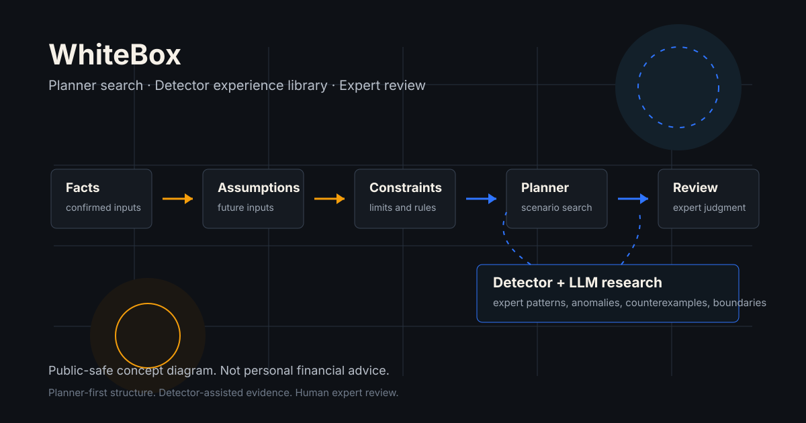

# 金融规划不是一个答案，而是一条可审计的推理链

[English](auditable-reasoning-chain.md)

金融规划经常被表达成一个单点答案：几岁退休、买什么产品、每年存多少钱、接受多高风险。这样的表达很容易传播，但它也遮住了规划里最重要的部分：一个家庭的事实，是如何经过假设、约束、情景和专业复核，最终形成建议的。

WhiteBox 的出发点不同。一个负责任的财务规划，不只是答案，而是一条可以审计的推理链：事实、假设、约束、情景、模型结果、detector 证据和专家复核，都应该被清楚地区分。

这件事在中国大陆市场尤其重要。很多家庭的资产负债表受到房产、家庭责任、教育支出、保险语境、流动性压力、退休不确定性和代际支持的共同影响。WhiteBox 是一个由本地财务规划、保险和家庭顾问实践共同塑造的 AI native 产品。在这样的环境里，一个好的规划系统不应该只会计算，还应该把判断的结构呈现出来。

## 单点建议的问题

当问题足够窄、假设足够稳定时，单点建议是有价值的。比如房贷月供、年度保费、某个现金流缺口，都可以在明确输入下计算。

但家庭财务规划很少这么窄。

一个退休决策，可能同时依赖房产价值、养老金预期、医疗风险、家庭支持义务、流动性储备、保险保障、教育承诺，以及未来收入冲击的发生顺序。一个产品建议，在某个现金流路径下看起来合适，在另一个路径下可能变得脆弱。一个风险偏好答案，情绪上可能合理，但和家庭真实的偿付能力约束并不一致。

问题不是数字不重要。问题是，当数字背后的假设消失时，数字会变得危险。

## WhiteBox 的看法

WhiteBox 把财务规划视为一个受治理的模型问题。它要区分哪些是已确认事实，哪些是假设，哪些是计算结果，哪些仍属于实验性研究，哪些还需要专家复核。

用公开语言来说，WhiteBox 的推理链包含六层：

- 家庭事实：资产、负债、收入、支出、保障、目标和家庭责任等已确认信息
- 假设条件：通胀、收入增长、退休时间、产品行为、流动性需求和其他情景输入
- 约束条件：现金流边界、偿付能力要求、保险适配性、产品限制、监管语境和家庭偏好
- 情景分析：对可能未来进行结构化比较，而不是假装某一个未来一定发生
- detector 证据：用于发现模式、异常、反例和边界条件的实验性信号
- 专家复核：在任何内容被视为正式意见之前，由顾问和领域专家解释、挑战和确认

这条链的目的，是让规划结论承担责任。如果一个输出依赖某个假设，这个假设应该可见。如果一个结果只是探索性的，它不应该被包装成正式建议。如果模型无法支持某个结论，系统应该明确说出来。

## Planner：先搜索情景，再形成建议

Planner 是 WhiteBox 方法论里坚持“先结构化，再建议”的部分。

在情景分析开始之前，规划问题应该先被表达成清楚的结构：目标是什么，约束是什么，优先级是什么，取舍关系是什么。一个家庭可能同时希望退休安全、教育资金、房产灵活性、保险保障和近期流动性。这些目标不是彼此独立的。一个维度被改善，另一个维度可能被削弱。

Planner-first system 不急着生成建议。它先确认正在解决什么问题，哪些事实已经确认，哪些假设仍然开放，哪些风险值得关注，以及什么样的结果才有资格进入正式复核。

一个可以借鉴的类比是 AlphaGo。AlphaGo 不是依靠单一线性规则下棋，而是把学习到的评估能力和蒙特卡洛树搜索结合起来。WhiteBox 不是游戏系统，财务规划也不是围棋。这个类比只用于说明一个更窄的思想：planner 可以把家庭财务规划视为一个结构化搜索问题，在不确定性下生成候选情景、进行压力测试、比较路径，并把每个结果对应的假设保留下来。

因此，planner 更像一个求解器。它探索可能路径，评估结果发生的概率和严重程度，并保持每个结论背后的事实和假设可见。它不声称某一个未来一定发生，而是判断哪一类方案在足够多的合理未来里仍然保持一致，值得进入专家复核。

当语言模型参与时，这一点更重要。语言模型可以帮助提取、组织和解释信息，但不应该生成正式财务数字，也不应该决定一个规划结论是否成立。Planner 的作用，是把推理问题保持在结构化状态，让计算、情景搜索和解释都处在可治理边界内。

## Detector：辅助专家式模式识别

WhiteBox 使用 detector 这个词，是为了描述一个仍处于实验阶段的研究方向。Detector 不是已经完成的建议引擎，而是用来研究可重复规划信号、风险模式、反例和边界条件的方法。

这个想法部分参考了认知科学中对专家能力的理解，尤其是 recognition-primed decision making，也就是基于识别的决策。专家并不只是套用规则。他们会识别有意义的模式，注意到一个案例什么时候不符合熟悉模式，并在脑中快速模拟某个行动是否可能有效。

财务规划有一个很难解决的验证问题。即使是很优秀的顾问，一生中亲自经历的完整规划成败案例也是有限的。有些决策需要十年、二十年甚至更久，才看得出当初的判断是否足够稳健。反馈既慢，又会受到市场、家庭、健康和政策变化的共同影响。

Detector + LLM 是 WhiteBox 尝试加速这个验证过程的方法，但它不会把这种加速包装成最终真理。你可以把 detector 理解成一种结构化的专家经验手册：里面记录线索、风险模式、已知失败方式和边界条件。LLM 可以帮助把具体案例和这本“经验手册”进行比对，提出相似情形，并暴露需要专家复核的地方。最终判断仍然属于专家，但系统可以更快地测试比单个专家亲身经历更多的模式。

在财务规划里，这种专家能力可能表现为下面这些问题：

- 一个家庭账面上是否看起来有流动性，但在短期现金流压力下其实很脆弱？
- 高名义资产是否掩盖了保险保障缺口？
- 退休计划是否过度依赖难以转化为收入的房产价值？
- 一个情景是否只是因为遗漏了家庭责任，才显得稳定？
- 某个建议是否对一个尚未复核的关键假设过度敏感？

Detector research 的目标，是让这些问题变得更可重复，也更容易被反驳和修正。它不替代专业判断，而是帮助专家看到更值得检查、挑战和改进的证据。

## 为什么中国大陆语境重要

财务规划系统不是脱离市场的抽象工具。一个为某个市场设计的模型，如果未经调整就搬到另一个市场，可能会产生误导。

WhiteBox 立足中国大陆家庭财务规划。这意味着系统必须尊重本土家庭行为和顾问语境，包括房产占比较高的资产负债表、代际家庭责任、教育资金压力、保险产品结构、退休收入不确定性，以及客户和顾问共同复核方案的方式。

这不只是本地化翻译，而会影响模型结构本身。一个忽略这些现实的规划引擎，可能输出看似整齐的数学结果，却无法通过专业复核。

这也是为什么 WhiteBox 不是把通用金融内容外面包一层 AI。它是一个 AI native 的财务规划产品：产品形态、模型边界和复核流程，都需要和本土领域专家一起设计。

## 什么是 Public-Safe

WhiteBox 可以公开讨论自己的理念、理论基础、市场定位和高层研究方向。但它不应该公开私有生产代码、客户数据、部署绑定、私有 prompt、未发布模型内部实现或内部证据包。

这个边界本身也是 WhiteBox 纪律的一部分。公开内容应该足够清楚、足够有用，但不暴露应当留在私有开发环境里的实现细节。

## 结语

WhiteBox 的承诺，不是让机器替代判断。它的承诺是让复杂的财务规划变得更可追踪、更可复核，并且更诚实地面对不确定性。

一个规划方案不应该要求人们相信黑箱。它应该把推理链展示到足够清楚，让专业人士可以挑战，让客户可以理解，也让系统在改进时不失去责任边界。

本文仅用于公开教育和研究讨论，不构成个人财务建议。

## 公开参考

- Gary Klein 的 recognition-primed decision model 说明了经验丰富的决策者如何在真实环境中使用模式识别和心理模拟：https://www.gary-klein.com/rpd
- Silver 等人在 2016 年 Nature 论文中介绍了 AlphaGo 如何结合 value networks、policy networks 和 Monte Carlo tree search：https://www.nature.com/articles/nature16961
