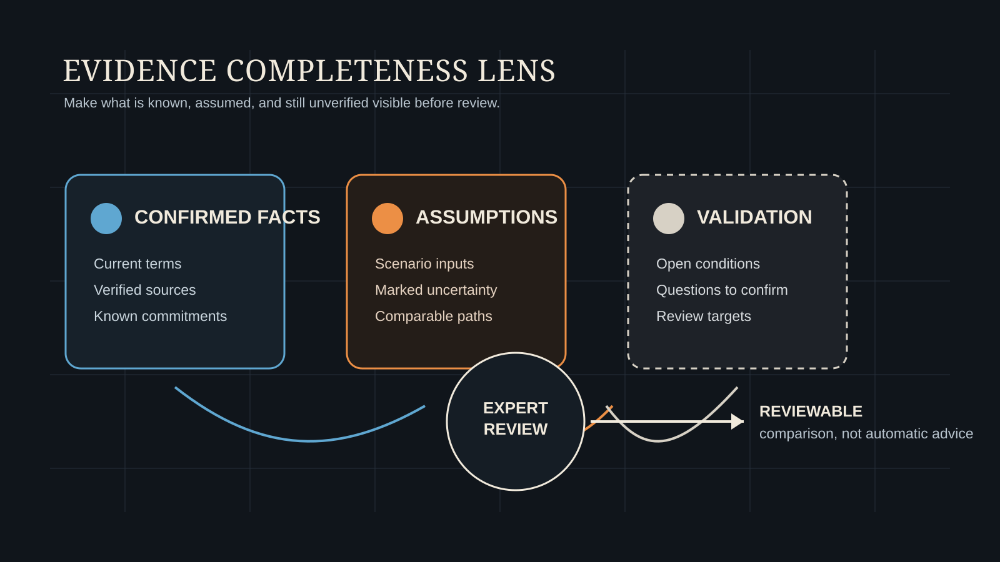

# Before a Signal: Check What the Plan Does Not Yet Know

[简体中文](before-a-signal.zh-CN.md)

A plan can look complete without containing the information needed for a reliable conclusion. A household may have mentioned its property, income, insurance, education plans, and support for parents. But mentioning an item does not confirm its amount, timing, accessibility, or responsibility boundary.

Before discussing risk or proposing a direction, a more important question may be: what does this plan not yet know?

## 1. Ask What Is Not Yet Known

Many planning errors do not come from an absence of calculation. They come from treating an unknown item as a confirmed fact too early. A property may have balance-sheet value, while its sale timing, transaction cost, and practical availability remain uncertain. A future expense may be called an education budget, while its year, currency, and priority have not been clarified.

Unknowns are not failures. Naming them clearly is what makes professional discussion possible.

## 2. Separate Missing Facts, Explicit Assumptions, and Validation Items

A planning discussion can separate uncertainty into three categories:

- **Missing facts:** contracts, amounts, terms, accessibility conditions, or liability arrangements that have not been obtained or confirmed.
- **Explicit assumptions:** temporary inputs used to compare scenarios, such as income, spending, inflation, returns, or changes in family responsibilities.
- **Validation items:** important matters that still require confirmation by the household, adviser, or another relevant professional.

Take “retiring at age 55” as an example. If employment arrangements and relevant eligibility conditions have not been confirmed, it is a missing fact. If age 55 is temporarily used to compare scenarios, it is a modelling assumption. If the household has a plan but its feasibility still needs confirmation, it is a validation item.

These categories should not be blended. A missing fact should not be dressed up as a model result; an assumption should not be treated as a commitment; and a validation item should not disappear from review merely because the explanation sounds fluent.

## 3. A Fictional Household Decision Moment

Consider a wholly fictional, non-client household in mainland China. Mr. and Ms. Li are discussing whether to buy a second home. On total assets alone, the down payment appears affordable; the family has an owner-occupied home, financial assets, and stable income.

A closer review makes the questions more concrete. If an existing property must be sold, its timing, transaction cost, and practical availability remain unconfirmed. The continuing premiums of an existing insurance arrangement may constrain future cash flow and need to be clarified. The timing and scale of support for parents are also only preliminary estimates.

This does not automatically mean that buying a second home is good or bad. It changes the order of discussion: establish the facts, state the assumptions, and then compare pressure and room for choice across scenarios, rather than presenting an incomplete judgement as a conclusion.

## 4. A Detector Prompts Review; It Does Not Replace Judgment

The value of professional planning is not to produce an apparently definite conclusion as quickly as possible. It is to recognise when the evidence is still insufficient to support one. Only when facts, assumptions, and validation items are clearly separated can a comparison be explained and reviewed.

WhiteBox treats detector work as an experimental research direction that expresses this principle: a way to organize recurring expert questions about missing information, unusual combinations, and boundary conditions into more repeatable review signals.

It does not decide for a household or turn incomplete information into advice. Its value is to help professionals see, before a conclusion is formed, which conditions remain unverified, which assumptions drive a comparison, and which questions must return to the real world for confirmation. Different assumptions may each be reasonable while leading to different planning conclusions. The purpose of planning is not to find one uniquely correct answer, but to compare choices on the basis of clear facts and assumptions.

*This article is for public education and research discussion only. It is not financial, insurance, investment, legal, tax, or individualized advice.*
