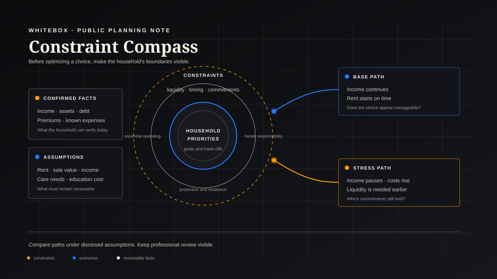

# Before Optimizing: Make the Household's Constraints Explicit

[简体中文](constraints-before-optimization.zh-CN.md)

Household planning should not begin by searching for the option with the highest return. It should begin by identifying what the household cannot casually sacrifice: essential living costs, debt payments, education arrangements, care responsibilities, necessary protection, and access to funds when they are needed.

## A Choice That Appears Reasonable

Mr. Chen, 42, and Ms. Li, 40, have a nine-year-old daughter. This is a fictional illustration only, using amounts in CNY.

Their after-tax household income is about CNY 720,000 a year. Their owner-occupied home is valued at roughly CNY 5.2 million, with CNY 2.1 million of mortgage remaining. Cash and financial investments total about CNY 1.8 million. Annual living costs, mortgage payments, insurance premiums, and regular support for parents total about CNY 590,000. Their daughter may enter university in nine years, and the couple hopes to reduce work gradually around age 60.

The family is considering an investment property, using about CNY 1.2 million of accessible assets for the down payment and related costs. If rent is stable and prices perform well, the option appears to offer a higher long-term return.

But a higher expected return does not automatically make an option more suitable for the household.

## Separate Facts, Assumptions, and Choices

Confirmed facts include the current balance sheet, mortgage, insurance premiums, known income, and current household expenses.

Rent, vacancy, resale value, income continuity, future elder-care needs, and education costs are assumptions. They should not be presented as certain outcomes.

Buying an investment property is a choice, not an unavoidable household objective.

Once these categories are separated, the family is no longer comparing abstract returns. It is comparing different future paths.

## Constraints, Goals, and Preferences

For the Chen family, constraints include the ability to continue paying for essential living, mortgage, insurance, and family responsibilities; retaining enough liquidity during income interruption; and avoiding forced asset sales under pressure.

Goals include supporting education, protecting retirement quality of life, and preserving resilience during difficult periods.

Preferences remain open to trade-off: property versus financial assets, growth versus flexibility, and buying now versus waiting.

Treating investment-property ownership as a goal would obscure an important point: it is only one possible route toward long-term growth.

## One Option, Two Futures

In a base scenario, income remains stable, the property is rented promptly, and parental support needs do not materially change. The purchase may appear manageable.

A stress scenario raises different questions. If one income stops for a year, rental income starts late, or elder-care costs rise, can the remaining liquid assets still cover mortgage, living costs, premiums, and unexpected expenses? Do education funding needs overlap with the remaining mortgage years? If the property must be sold, can it be sold at an appropriate time and price?

This does not prove that the purchase is wrong. It shows why planning should not rely on one smooth path. The family needs to state how much liquidity it wishes to retain, which obligations cannot be reduced, and which changed assumptions require the plan to be revisited.

Instead of answering "should the family buy?", a more rigorous comparison considers several candidate paths:

- buy the investment property now;
- reduce the down payment or phase the allocation;
- wait while retaining more liquidity; and
- compare those paths under different income, rent, and care-cost conditions.

## What WhiteBox Should Do Here

WhiteBox's public planning philosophy is not to turn a household into a score or a model result into an automatic recommendation.

Its useful role is to keep confirmed facts, assumptions, constraints, long-term goals, and candidate scenarios visibly separate; show what changes the comparison; and preserve areas requiring expert review.

The real question is not "which option has the highest return?" It is: when the household is under its greatest pressure, which option still respects its important responsibilities and preserves meaningful choice?

This article is for public education and research discussion only. It is not insurance, investment, tax, or individualized financial advice.
