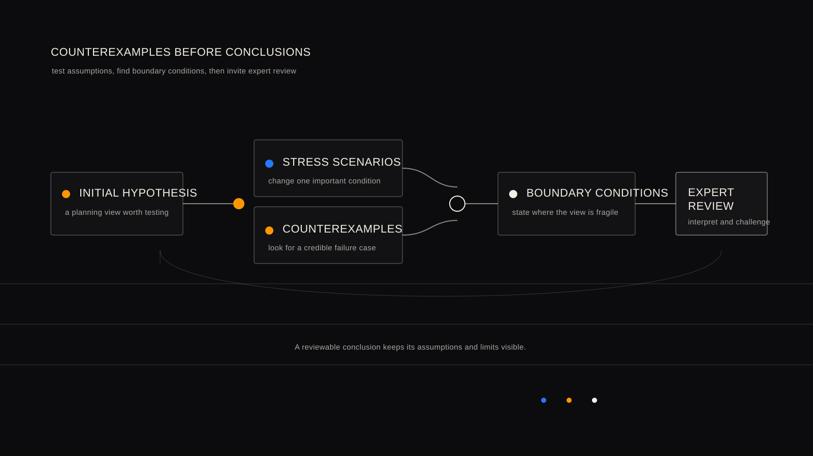

# 结论之前：为什么财务规划需要反例

[English](counterexamples-before-conclusions.md)

财务规划中的错误，往往不来自完全没有计算，而来自一个“看起来合理”的结论没有被认真追问：它会在什么条件下失效？

反例不是为了否定一个规划方向。它是一种有纪律的检验方式：寻找一个同样合理、但会让原有结论变得脆弱的情境。若一个方案只能在收入持续稳定、家庭责任不变、资产可以快速变现等条件下成立，那么这些条件就应被明确写出，并接受专业复核。

## 从合理结论到失效条件

单一结论容易掩盖依赖关系。例如，一个家庭可能拥有较高的房产价值，也有稳定收入，因此看起来具备长期储蓄或新增承诺的能力。但如果教育支出提前、收入暂时下降，或房产无法在需要时快速变现，原来的判断是否仍然成立？

这不是在预测未来。它是在区分已经确认的事实、尚未验证的假设，以及不能被忽略的约束。好的规划不只说明“为什么可行”，也说明“什么会使它不再可行”。

## Detector 研究：让复核问题更可重复

WhiteBox 将 detector 视为一项实验性研究方向，而不是自动化顾问。它尝试把专家常见的复核问题整理为可讨论、可检验的信号、反例和边界条件。

例如，研究可以提出以下问题：

- 高名义资产是否掩盖了近期流动性压力？
- 某个退休目标是否过度依赖尚未复核的收入或资产假设？
- 一项保障安排降低了一种风险，却是否增加了保费压力？
- 一个方案是否遗漏了代际支持、教育支出或医疗责任等重要条件？

这些问题不自动产生建议。它们的作用是让专业人士更早发现需要验证的地方，并主动寻找与初始判断不一致的证据。

## 虚构说明：资产充足并不等于稳健

设想一个完全虚构的家庭：家庭资产中房产占比较高，收入目前稳定，同时需要兼顾子女教育、父母支持和退休准备。若只看资产规模，长期承诺似乎可以承担；若加入收入短暂波动和近期开支上升的情境，关键问题就变成家庭是否有足够的可用现金流。

这个反例并不规定应采取什么行动。它只是揭示：原先的结论依赖于哪些条件，以及哪些取舍应进入专家复核。

## 人的判断仍在结论之前

在中国大陆家庭规划中，房产集中、代际责任、教育投入、保障需求和退休收入不确定性常常同时出现。任何结构化信号都需要由了解家庭背景和当地专业语境的人解释。

WhiteBox 的公开研究方向，是让规划过程更可追溯、更容易讨论，也更诚实地呈现不确定性。反例不是系统的最终答案；它是专家在形成结论之前应当看到的一个问题。

本文仅用于公开教育和研究讨论，不构成个人财务建议。
