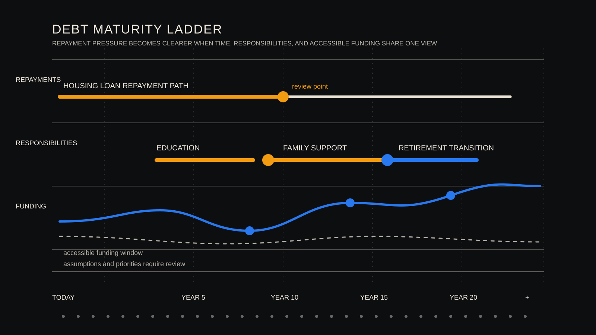

# 负债有时间表：规划偿还路径，而不只看余额

[English](debt-has-a-timeline.md)

一笔贷款余额应当写进家庭资产负债表。它说明家庭今天还欠多少，却无法单独呈现还款、融资成本变化和其他家庭责任在未来几年形成的压力。

家庭规划也需要一张负债时间表。

## 余额回答了什么，时间表又遗漏了什么

余额回答了一个有用的问题，今天还有多少未偿还。规划讨论还需要问，款项在何时到期，会持续多久，条款是否可能变化，以及预期由哪些收入来源支持。

这一区分尤其适用于中国大陆家庭。住房、教育、父母支持、保费和退休准备都可能占用收入。一项负债单独看可以承受，若多项责任在相近年份重叠，家庭的调整空间就会收窄。

## 把还款、融资成本变化与家庭责任放到同一条线

把承诺放在同一条时间线上，彼此的关系才会清楚。房贷可能持续多年，教育支出可能较晚开始却迅速增加，父母照护的金额和时间也常有不确定性。家庭换工作、减少工作强度或接近退休时，收入结构同样可能改变。

这幅图比单一时点的资产负债表更有用。它能显示可靠收入需要同时承担多项责任的年份，也能显示家庭相对有余地调整的阶段。

## 一个虚构家庭的决策时刻

设想一个虚构的中国大陆家庭。夫妻都在四十岁出头，仍有二十年期住房贷款，孩子预计八年后进入大学，父母的照护支出也可能逐步增加。家庭目前收入稳定，持有现金和长期金融投资。

只看资产总额和贷款余额时，家庭可能感到安心。时间表会提出更具体的问题。教育费用、家庭支持支出上升和一段收入下降的时期，若在房贷仍需支付时相遇，家庭能如何安排。

这个例子不预测这家人的未来，也不推荐某一种金融产品。它只是说明，家庭有必要把时间、流动性和承诺一起比较。

## 用情景比较偿付压力

基础情景可以沿用当前的收入、支出和还款假设。压力情景可以考察短暂的收入中断、日常支出增加、融资成本变化或资产出售延后。情景不预测未来，它们让家庭对某些假设的依赖能够被讨论和复核。

有用的问题包括，哪些付款必须持续，哪些资源能在需要的时间合理动用，以及哪些年份的现金流余量最小。答案取决于已经确认的事实、明确写出的假设和家庭自身的优先级。

## 让负债讨论可以复核

WhiteBox 公开讨论的规划视角，会把已经确认的合同和余额，与可复核的假设和家庭的个人选择分开记录。结构化时间表可以呈现偿付压力与可能的边界条件，同时避免把某一条路径表述为确定结果。

合同条款、适当性、法律和税务因素，以及家庭优先级，仍需要专业判断。本文仅用于公开教育与研究讨论，不构成个人财务、投资、保险或信贷建议。

