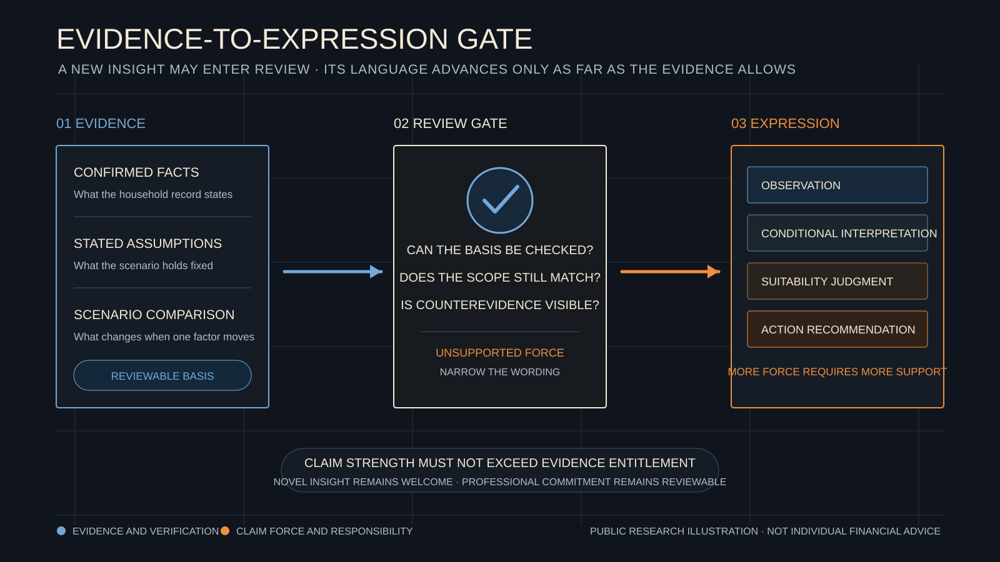

# A Model May Find New Insight. Why It Still Needs Boundaries for Professional Claims

[简体中文](evidence-entitlement-and-claim-strength.zh-CN.md)

> Governance Kernel in this article describes a future WhiteBox research and product direction, not an existing production capability.

A model may notice a relationship in scenario results that people had not previously considered. Such a finding is worth preserving and testing. Before that test, it remains a reviewable question. It does not automatically earn the right to appear as a professional conclusion.

WhiteBox uses a simple boundary. Evidence should determine the strength of the language used to describe it. A verifiable observation can help an expert ask the next question. A statement about suitability, priority, or action requires broader facts, comparison, and accountable judgment.

## A New Insight First Becomes a Reviewable Question

WhiteBox studies ways to keep household-planning assumptions, constraints, scenario results, and explanations traceable. A model may help organize this material. It may also identify a relationship that has not been made explicit before.

A new relationship can be one of the useful contributions of a stronger model. The risk appears when a sentence moves from observation to explanation, then begins to carry the weight of advice without making that change visible.

Governance should allow a model to propose unfamiliar relationships. It should also require each professional claim to show its basis, scope, and supported degree of force.

## A Fictional Household and an Overlap in Time

Consider a fictional household. Mr. Li is forty-nine and expects to reduce work around age fifty-six. The family has twelve years of mortgage payments remaining. University costs for a child are expected to concentrate in the first years of the retirement transition, and the family has also reserved spending for parental care.

Several illustrative scenarios show that accessible assets decline most quickly between ages fifty-six and fifty-nine. A model notices that education costs, the income transition, and mortgage payments overlap in that period. It proposes a statement.

> Under the current scenario, the overlap may be one source of liquidity pressure in early retirement.

This is a useful insight. The timing and scenario results can be checked, and the language retains its conditions and scope.

“Mr. Li should retire early” is a different kind of statement. It would require comparison with other paths, an understanding of family preferences, health and care arrangements, income variation, and the cost of changing course. A professional would also need to take responsibility for that judgment.

## Evidence Determines How Far Language May Go

A set of scenario results may support the statement that a particular period contains pressure under current assumptions. A paired scenario can help test whether one expense is an important contributor. Multiple stress scenarios, household goals, and comparisons among available paths can move the analysis toward a judgment about plan quality.

Language should therefore follow the evidence. “There is an overlap” describes an observable relationship. “It may create liquidity pressure” offers an explanation supported by the scenario. “This arrangement is suitable for the household” needs wider evidence, while “the household should take a particular action” adds responsibility and consequence.

The latter statements can be appropriate. They require stronger support and clarity about who is making and owning the judgment.

> Claim strength must not exceed evidence entitlement.

Evidence entitlement means the degree of professional expression that the current facts, tests, and comparisons can support. It gives a new insight room to enter review while preventing an observation from quietly becoming advice.

## Stronger Models Need Clearer Commitment Boundaries

As model capability improves, a system may become better at finding unexpected relationships, counterexamples, and new comparison paths. Public research should allow novel findings to enter review. Familiarity alone is a poor test of value.

WhiteBox is exploring Governance Kernel as a way to separate what a model may propose from how strongly WhiteBox may present it. The first category should retain room for exploration. The second should remain bounded by evidence, scope, and responsibility.

That boundary serves readers. It makes the conditions behind fluent language visible again. It also helps professionals see what evidence is missing, which paths need comparison, and who must complete the judgment.

## The Judgment That Remains with Experts

Household planning involves goals, relationships, time, and consequences that a family can bear. A model can propose questions, organize evidence, and flag relationships worth testing. Professionals still decide what those relationships mean for a particular household.

WhiteBox treats GK as a future research direction. Public, reproducible fictional cases can test which combinations of evidence support different degrees of professional expression. They can also test whether governance preserves the value of a new insight.

This article is for public education and research discussion only. It is not investment, insurance, tax, or individualized financial advice.
