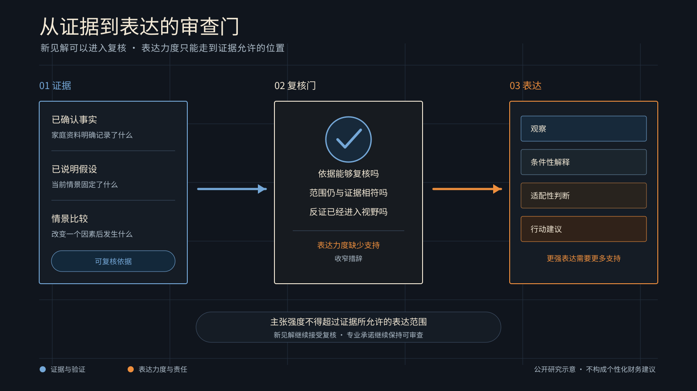

# 模型可以提出新见解，专业表达仍需边界

[English](evidence-entitlement-and-claim-strength.md)

> 本文所说的 Governance Kernel 是 WhiteBox 未来的研究与产品方向，不代表现有生产能力。

模型有时能从一组情景结果中提出人们原先没有注意到的关系。这类发现值得保留，也应当接受检验。它在通过检验以前，仍然只是一个待复核的问题，还没有自动获得进入专业表达的资格。

WhiteBox 关心的边界很直接。证据支持到什么程度，结论就应当用相应力度的语言表达。一个可验证的观察可以帮助专家继续追问。涉及适配性、优先级或行动的句子，需要更完整的事实、比较和责任判断。

## 新见解先成为可复核问题

WhiteBox 研究的目标包括让家庭规划中的假设、约束、情景结果和解释保持可追溯。模型可以帮助整理材料，也可以指出一组数字之间新出现的关系。

新关系可能是更强模型带来的价值，前提是它能够接受复核。风险出现在一句话继续向前走时。读者很难看出它何时从观察变成了解释，又何时开始携带建议的分量。

治理应当允许模型提出陌生关系，同时要求每一句专业表达说明自己的依据、范围和可以承担的力度。

## 一个虚构家庭的时间重叠

设想一个虚构家庭。李先生四十九岁，计划在五十六岁前后减少工作。他们仍有十二年房贷，孩子的大学支出预计集中在李先生退休过渡的前几年，家庭也为父母照护预留了支出。

几组说明性情景显示，五十六岁至五十九岁是可动用资产下降最快的窗口。模型注意到，教育支出、收入转换和房贷付款在这段时间重叠。它提出一句话。

> 在当前情景下，这几项支出在同一时期叠加，可能是退休初期流动性压力的一个来源。

这是一条有价值的发现。时间表和情景结果可以复核，措辞也保留了它的条件与范围。

“李先生应当提前退休”属于另一类表达。它需要比较更多路径，理解家庭偏好、健康和照护安排，评估收入变化与调整成本，并由专业人士承担判断责任。

## 证据决定表达可达到的力度

一组情景结果可以支持“在当前假设下，某个窗口存在压力”。配对情景能够帮助检验某项支出是否是重要因素。多种压力情景、家庭目标与可选方案的比较，才逐步接近对计划质量的判断。

语言应当跟着证据走。“存在重叠”描述一个可观察的关系。“可能带来流动性压力”提出一个受情景支持的解释。到了“这个安排适合该家庭”，证据范围需要扩大。“家庭应当采取某项行动”还增加了责任与后果。

后面两类句子可以成立。它们需要更高层级的依据，也需要明确谁在作出和承担该判断。

> 主张强度不得超过证据所允许的表达范围。

这里所说的证据资格，指当前事实、检验和比较能够支持多大力度的专业表达。它让新见解有机会进入复核，也防止一项观察悄悄变成建议。

## 更强模型需要更清楚的承诺边界

模型能力提高后，系统可能更容易发现意外关系、反例和新的比较路径。公共研究应当让新发现进入复核，熟悉程度无法决定一项发现的价值。

WhiteBox 正在把 Governance Kernel 作为未来研究方向，区分模型可以提出什么，以及 WhiteBox 可以用多强的方式表达什么。前者应当保留探索空间，后者需要受到证据、范围和责任的约束。

这个边界服务于读者。它让一句流畅的话重新显示出自己的条件，也让专业人员知道下一步该补什么材料、比较什么路径、由谁完成判断。

## 留给专家的判断

家庭规划涉及目标、关系、时间和可承受的后果。模型可以提出问题，组织证据，标出值得核验的关系。专业人员仍需决定这些关系对一个具体家庭意味着什么。

WhiteBox 将 GK 视为未来研究方向。公开、可复现的虚构案例将有助于检验不同证据组合能支持怎样的表达力度，也能检验治理是否保留新见解的价值。

本文仅用于公共教育和研究讨论，不构成投资、保险、税务或个性化财务建议。
