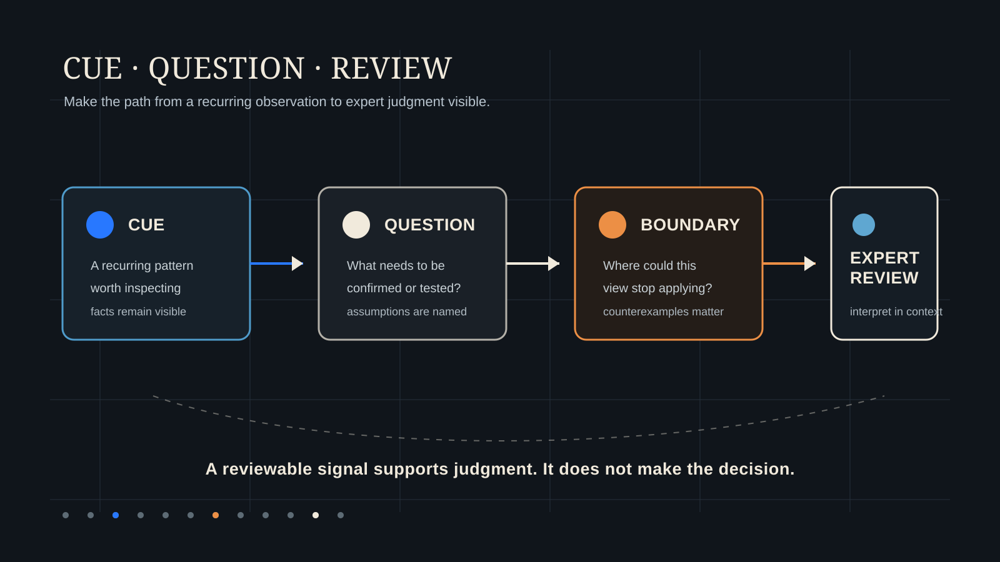

# 从专家经验到可复核问题：规划 Detector 能做什么，不能做什么

[English](expert-experience-to-reviewable-questions.md)

经验丰富的规划师看到一份家庭规划资料时，常会在几个地方停下来。房产可能占了家庭财富的大部分，手头可用资金却不多。收入目前稳定，教育、赡养和保费承诺却集中在同一时期。一项保障安排降低了某类风险，同时也可能压缩长期现金流。

这些观察来自经验，也需要把依据说清楚。WhiteBox 的公开 Detector 研究，尝试把反复出现的专家线索整理为可复核的问题，让规划判断的依据、范围和限度都能被讨论。

## 1. 专家经验常从一个线索开始

线索是一项值得进一步查看的观察。它不等于结论，也不等于建议。比如，规划师注意到家庭财富高度集中在房产，短期内有多项承诺到期，或一项收入来源承担了多项长期责任。

线索之所以值得重视，是因为家庭规划中的事实会随着时间相互影响。一份资产负债表可能看起来稳健，实际可用现金流却已承压。一项目标今天似乎负担得起，按揭、家庭支持或退休时间一旦变化，方案就可能变得脆弱。

## 2. 线索需要转成清楚的复核问题

接下来要问的问题，应当能够被具体检查。家庭是否有足够的可用资源覆盖最先到期的承诺？目前的判断依赖哪些收入、支出或房产流动性假设？如果一项家庭责任更早开始或持续更久，方案会发生什么变化？

这类问题能让事实、假设和待确认事项继续留在视野里。它们也让顾问和家庭可以围绕优先级进行有依据的讨论，不必把早期判断当作既定答案。

## 3. Detector 研究整理反复出现的提问

WhiteBox 所说的 Detector 是一项实验性研究方向。它尝试将专家反复提出的问题整理为更可重复的复核信号。Detector 可以提示某种模式值得查看，指出可能缺失的事实，或提出需要检验的边界条件。

它不替家庭作决定，也不把一个信号自动转成建议。相似的信号可能来自不同的家庭结构、合同安排和人生阶段。因此，严谨的研究需要检验信号是否重复出现，主动寻找反例，并记录信号可能不适用的情形。

## 4. 中国大陆语境会改变提问方式

对许多中国大陆家庭而言，房产、按揭、教育资金、父母支持、保险承诺和退休准备往往彼此相连。同一个资产负债表比率，面对近期还款、教育支出或房产难以出售的家庭时，可能有不同的现实含义。

本土专业判断仍然不可缺少。它帮助人们区分真正需要关注的预警线索，与家庭在已知约束和优先级下作出的合理选择。

## 5. 专家复核仍是决策边界

Detector 研究的目标，是让经验更容易被检查、讨论和改进。它的输出应保留线索、问题、假设和不确定性，以便专业人士复核。

正式的规划结论仍应建立在已确认事实、明确假设、可追溯分析和专业解释之上。Detector 可以帮助专家更早看到问题，专家仍负责结合具体情境判断问题的含义。

*本文仅用于公开教育与研究讨论，不构成针对任何个人或家庭的金融、保险、投资、法律或税务建议。*
