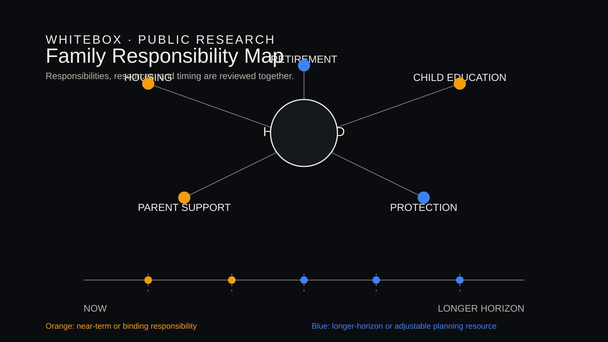

# A Household Is Not One Decision-Maker: Making Family Responsibility Explicit in Financial Planning

[简体中文](family-responsibility-is-a-planning-constraint.zh-CN.md)

This article is for public education and research discussion only. It is not personal financial advice.

Financial planning is often framed as an individual choice: whether to buy a home, how much to save, when to retire, or how to arrange protection. For many households in mainland China, however, those choices also connect spouses, children, parents, and other important relationships. A household is not a single decision-maker, and planning should not begin with one person's income or assets alone.

## Why Planning Cannot Stop at the Individual

The same level of assets does not create the same room to act for every household. One family may be preparing for education, parental support, mortgage obligations, protection premiums, and retirement at the same time; another may face a different sequence of obligations and a different support network. The purpose is not to judge family responsibility. It is to make it clear enough to discuss and review.

## Turning Responsibilities into Explicit Assumptions

"Supporting parents may be necessary in the future" or "the family hopes to prepare for education" is not yet a calculation result. It is a planning assumption that needs further description: when it may arise, how long it may last, who may bear it, which parts are inflexible, which can change, and which facts remain unconfirmed.

Making those questions explicit does not create false precision. It prevents important responsibilities from disappearing into vague language. Once stated, assumptions can be tested for reasonableness, range, and interaction with other goals.

## Distinguishing Responsibility, Assets, and Cash Flow

Assets describe what a household owns and owes. Cash flow describes whether it can sustain ordinary and committed spending. Family responsibility describes whom resources may need to serve, when, and with what priority. They are connected, but they are not interchangeable.

For example, substantial property value does not automatically meet a near-term education or care obligation. Stable income does not prove that every long-term commitment is sustainable. Separating responsibility from assets and cash flow shifts the discussion from "how much does the household have?" to "which resources can serve which responsibilities, and when?"

## Comparing Scenarios Instead of Presuming an Answer

A suitable public-research approach is to compare clearly labelled scenarios: whether responsibilities remain manageable with stable income; which obligations become binding during a temporary income disruption; and which longer-term objectives need review when timing changes.

A scenario is neither a forecast nor a recommendation. It is a way to make assumptions, constraints, and trade-offs visible. Qualified professionals should review results against the relevant facts, product conditions, and suitability requirements.

## What Expert Review Should Examine

Expert review can begin with these questions:

- Which responsibilities are confirmed, and which remain household assumptions?
- Which expenses have a defined timing and priority?
- Does access to assets match the timing of the responsibility?
- Does reducing one pressure introduce another risk?
- Across scenarios, what changed: facts, assumptions, or the household's goals?

WhiteBox's public research direction is to make these responsibilities, constraints, and trade-offs clearer, more traceable, and easier for professionals to discuss.
