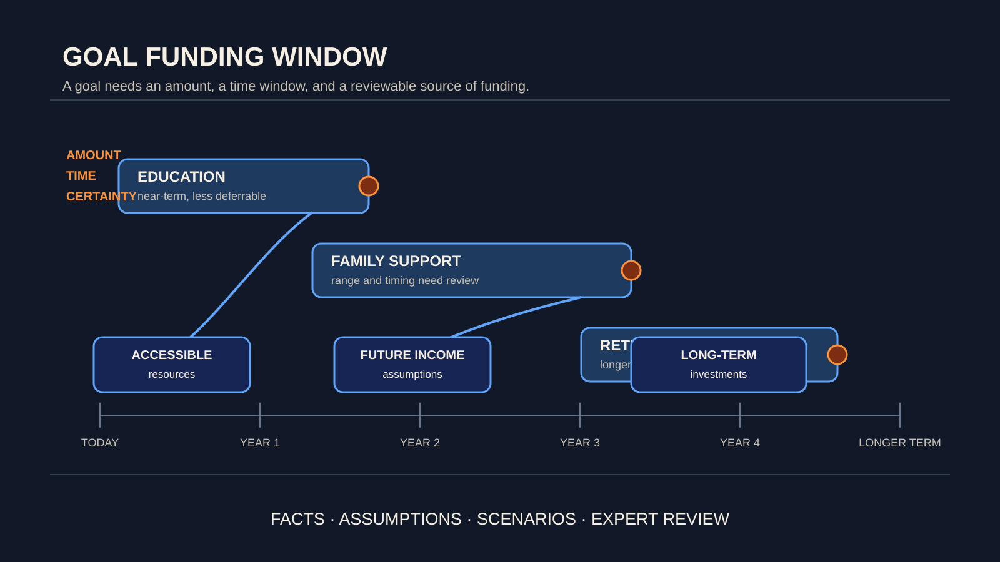

# 目标不是有了一个数字就算被满足：让资金与时间匹配

[English](goals-need-time.md)

本文使用虚构说明，仅用于公开教育和研究讨论，不构成个人财务建议。

很多家庭会先问：“我们需要存到多少钱？”这是一个合理的起点，却不是完整的问题。

同样是一笔 100 万元，三年后必须支付的教育费用、十五年后可能发生的养老支出，以及长期希望保留的家庭安全垫，对资金的要求并不相同。金额只是目标的一部分；时间、可动用性和结果的不确定性，同样决定一个目标是否真正“被资金支持”。

## 目标金额为何不等于已被满足

资产总额看起来足够，不代表某项责任在需要时能够被完成。部分资产可能难以快速变现，部分收入尚未发生，部分计划则依赖未来市场、工作收入或家庭协作继续按预期发展。

因此，“拥有资产”与“能够在某个时间窗口履行责任”之间，仍有一段需要被认真检查的距离。规划的任务不是把所有未来压缩成今天的一个数字，而是让每项重要责任都能找到与之相匹配的资金来源和时间安排。

## 把目标拆成金额、时间与确定性

一个可讨论的家庭目标，至少应说明三件事：

- **金额：**需要多少资源，范围是否可能变化；
- **时间：**最早何时需要、最晚何时不能再推迟；
- **确定性：**这项支出是已承诺责任，还是可调整的愿望。

这三项信息能帮助家庭区分：哪些资金需要保持较高可用性，哪些可以承受更长周期，哪些假设需要在未来重新确认。它不是把生活变成公式，而是避免用一个总额掩盖不同责任之间的优先级。

## 虚构案例：看似充足的家庭，仍可能错配

以一个虚构的中国大陆家庭为例：林先生和周女士拥有自住房、长期投资和稳定工资收入。他们希望为孩子预留大学阶段支出，也计划在未来照顾父母，并在十多年后逐步降低工作强度。

从总资产看，家庭似乎很稳健。但把目标放到时间线上后，问题变得更具体：教育费用集中在较近的几年；父母支持的金额和起点存在不确定性；退休后的收入转换则需要更长时间验证。若把所有资源都视为同一种“可用资金”，家庭可能低估近期压力，也可能过早牺牲长期选择。

这不是某个家庭应当采取的建议，而是一种检查方式：先看责任何时发生，再讨论哪类资源更适合支持它。

## 比较路径，而非承诺单一答案

严谨的规划不应假装知道未来的唯一答案。更有价值的做法，是把不同假设下的路径放在一起比较：收入变化更早发生时会怎样？某项责任延后或扩大时会怎样？市场回报低于预期时，近期目标是否仍有保护空间？

WhiteBox 公开研究所关注的，是让这类比较建立在清晰事实、明确假设和可审阅的约束上。系统可以协助整理情景与暴露取舍；对家庭意味着什么，仍需要专业人士与家庭共同判断。

## 让目标成为可复核的资金安排

一个好的目标不只是“未来要有多少钱”，而是“在什么时间、为哪项责任、依靠什么来源，并在何种不确定性下仍值得检视”。

当资金与时间开始匹配，规划讨论才会从抽象的资产数字，走向更清楚、更诚实的家庭选择。
