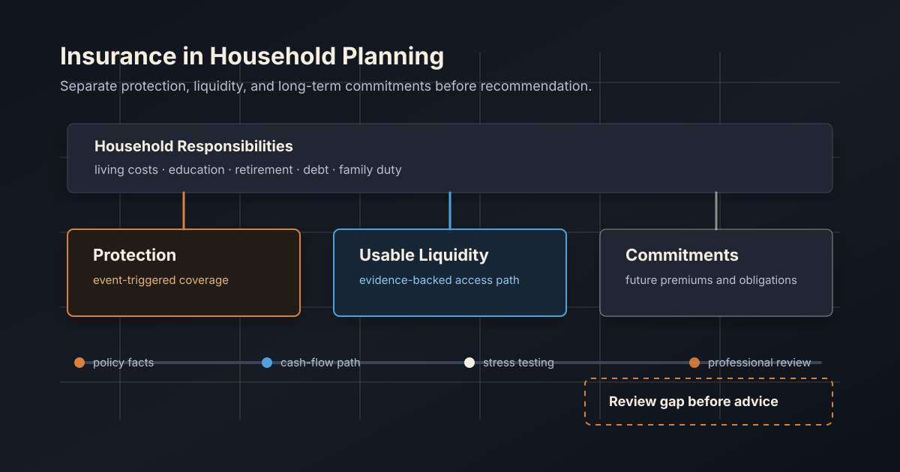

# Insurance in Household Planning: Read Today’s Balance Sheet, Then Tomorrow’s Paths

[简体中文](insurance-protection-liquidity.zh-CN.md)

When people consider insurance, they often ask: "Is the coverage enough?" or "Is this policy worth it?"

Those questions matter. But household planning asks one more question: how does this policy affect the family today, and how may it shape the years ahead?

## Not One Number, But Three Different Things

A policy can contain three distinct elements:

- protection triggered by a defined event;
- value that may become available under stated conditions;
- future premiums the household must continue to pay.

They are not interchangeable. Coverage is not cash in hand. A cash-value policy is not a checking account. Future premiums are not a minor expense that can be ignored.

In household planning, contract-supported policy value may become part of planning resources when the evidence is clear. Future premiums should be treated as long-term commitments. Protection itself represents risk transfer, not wealth that is already available today.

## Annuities: Closer To Future Income Than Cash Today

The main value of an annuity is often a scheduled future income stream. It may support retirement spending, living costs, or other long-term responsibilities in the years when payments arrive.

Planning should therefore place annuity income back into the years where it belongs. Treating years of future payments as cash available today can overstate liquidity. Counting both the income stream and the same underlying entitlement twice can overstate resources as well.

Rigorous planning avoids both errors.

## Incremental Whole Life: A Conditional Reserve

An incremental whole-life or cash-value policy often sits between protection and reserve planning. It may build policy value over time, but whether it can be used, when it can be used, and how much can be used all depend on contract information and value evidence.

For a household, it is better understood as a conditional safety reserve than as everyday cash. It may help under pressure, but it can also come with continuing premiums, exit limits, and trade-offs after use.

So the planning question is not only "what is the policy value?" It is also: when is that value available, what is given up when it is used, and can the household sustain the future commitment?

## Why Long-Term Stress Testing Matters

A plan must look beyond whether this year's budget works. It should consider income interruption, rising expenses, market uncertainty, and periods when family responsibilities are concentrated.

In plain language, a Monte Carlo ruin rate describes how many modeled future paths cannot continue meeting important household obligations within a stated planning period and under disclosed assumptions.

Insurance does not move that result in only one direction:

- scheduled annuity income or usable policy value may support the household during pressure periods;
- a premium commitment that is too heavy or poorly timed may reduce cash-flow flexibility;
- ignoring access conditions, surrender limits, or future premiums can distort the conclusion.

The useful comparison is not simply "with insurance" versus "without insurance." It is the full path: policy facts, premium timing, accessible value, protection triggers, and household responsibilities.

## WhiteBox’s Planning View

WhiteBox does not reduce insurance to a single asset figure or turn a number into an automatic recommendation.

Its public planning philosophy is to clarify:

1. which policy facts are confirmed;
2. which values depend on conditions and assumptions;
3. which premiums are future commitments;
4. how these arrangements change long-term household resilience across different future paths;
5. where professional review is still required.

That shifts the conversation from "is this policy good?" to a more useful set of questions: what does it protect, what does it consume, when can it help, and can the household sustain it over time?

This article is for public education and research discussion only. It is not insurance, investment, tax, or individualized financial advice.
