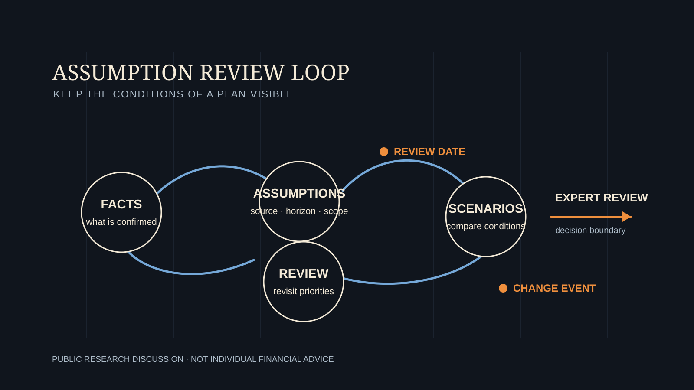

# A Plan Is a Living Decision: Assumptions, Review Dates, and Change Triggers

[简体中文](living-plan-review-loop.zh-CN.md)

Household planning often starts with a present-tense question: should a family buy a home, change an investment allocation, add protection, or prepare earlier for retirement? Any answer that appears reasonable today depends on conditions such as income, spending, family responsibilities, liquidity, and timing. When those conditions change, the answer should be reviewed too.

## A Plan Is Not a One-Time Answer

Planning does not end when a set of figures produces a conclusion. It is a decision process across life stages. Education funding, mortgage repayment, support for parents, career changes, retirement preparation, and protection needs do not arrive at the same time or change at the same pace.

A rigorous plan should therefore state the conditions under which it applies, not merely present a direction. It should show the household and its advisers which responsibilities cannot easily be reduced, which choices remain flexible, and which changes would make the original comparison unreliable.

## Assumptions Need a Source, Horizon, and Scope

Assumptions are not a flaw. Future income, expense growth, asset liquidity, and retirement timing cannot be fully confirmed today. The problem arises when an assumption is treated as a fact, or when its review point is forgotten.

A useful assumption should answer three questions: what information supports it; how long it is expected to apply; and which goals, responsibilities, or options it would affect if it changed. Stable income, for example, may support a current saving pattern. But if that income also supports a mortgage, education funding, and retirement preparation, the plan should make clear what takes priority if income is interrupted.

## Use Dates and Events to Trigger Review

Review should not begin only after a problem appears. A plan can set clear dates, such as an annual review or review around education, retirement, or loan-reset milestones. It can also identify event triggers: a meaningful income change, added family responsibility, major care needs, reduced asset liquidity, or changed policy and contract conditions.

These triggers are not automatic recommendations or predictions. Their purpose is to signal that the original assumptions may no longer hold, and that alternative paths and priorities should be examined again.

## Professional Review Remains the Decision Boundary

WhiteBox's public research direction is to keep facts, assumptions, constraints, candidate scenarios, and open review questions visible. A system can help organize the questions; it cannot decide a household's values or replace professional judgment about completeness, suitability, and real-world constraints.

A good plan does not promise an answer that never changes. It provides a disciplined way to see why review is needed, which responsibilities come first, and which choices deserve to be discussed again.

*This article is for public education and research discussion only. It is not personal financial, investment, insurance, legal, or tax advice.*
