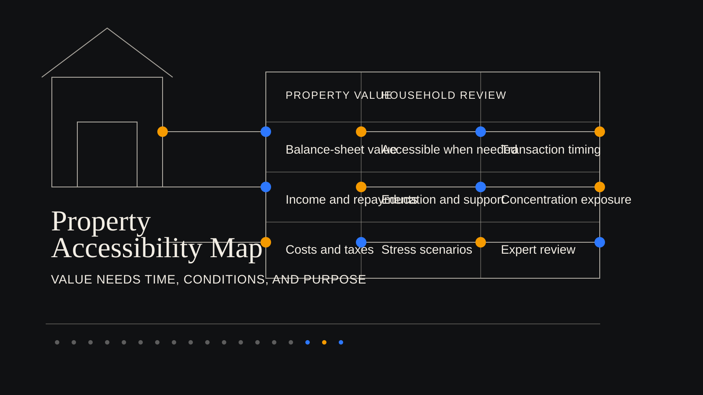

# A Home Is an Asset, Not a Spending Plan

[简体中文](property-is-not-spending-plan.zh-CN.md)

This article uses a wholly fictional household scenario for public education and research discussion. It is not individualized advice.

When education costs, support for parents, or a period of lower income arrives, a household's hardest question is often not the total on its balance sheet.

For many households, an owner-occupied home is one of the largest entries on that balance sheet. It has clear value and supports everyday life. Yet when money is needed within two years, the home can help only under particular conditions. A sale takes time. Borrowing must be repaid. Renting out the property can change living arrangements. Transaction costs, taxes, and moving also carry practical consequences.

A balance sheet records ownership and value. Education spending, retirement income needs, and family-support responsibilities arrive at particular points in time. A household needs both views before it can tell whether its resources can meet the next obligation.

## Property Value Needs a Timeframe

An owner-occupied home can provide stable housing while representing much of a household's wealth. Its value does not automatically become cash that can be used whenever an expense appears.

Selling requires a buyer, a transaction process, and suitable timing. Renting can produce income while adding questions about tenants, vacancy, and where the household lives. Borrowing against property adds repayment obligations and can tighten monthly cash flow. A housing exchange may sound like an asset adjustment, yet it also determines where the household will live, what it must pay each month, and how much flexibility remains if circumstances change.

A useful discussion therefore makes the questions concrete. Under what conditions would the property be used? How would that choice change monthly spending? If a transaction took several months longer, what would cover education, retirement, or family-support commitments already scheduled to arrive?

There is no preset answer. These questions turn property from a single total into a resource whose conditions, timing, and purpose can be examined.

## Concentration Can Magnify One Set of Changes

Property-heavy households can face pressure from the same direction at the same time.

When market conditions weaken, property values may come under pressure. When transactions slow, planned sales or exchanges may be delayed. When income varies, mortgage payments, premiums, education costs, and ordinary living expenses still arrive each month. The property may retain value while the household first has to manage immediate cash flow.

For that reason, total assets alone do not show whether an arrangement is sustainable. A household also needs to know which funds can be used promptly, which responsibilities cannot be deferred, and whether a choice leaves enough room for the next few years.

## A Fictional Household's Choice

Mr. Zhou and Ms. Lin are a wholly fictional three-person household in mainland China. They own a primary residence, hold some financial assets, and receive stable wage income. Their child will need education funding. Both sets of parents may need support. The couple are also preparing for retirement.

They are considering a second home. The down payment appears manageable when viewed against total assets, and their existing home has substantial value. The discussion changes once a timeline is placed beside those figures.

Education costs arrive first. The amount and timing of parental support remain uncertain. Mortgage payments for a second home could continue for many years. If income falls for a period, or a property transaction takes longer than expected, the household needs to know which funds it can use first and which resources must remain in place.

This illustration does not tell the household to buy or not to buy. It makes one point visible. Property value, cash flow, and time need to be reviewed together. Leaving out one of them can postpone pressure until the moment it becomes unavoidable.

## Put Several Scenarios on the Table

With stable income and expenses arriving as planned, the second-home arrangement may appear manageable.

If income falls temporarily while education costs arrive earlier, the household has to review available funds and monthly repayments again. If a property transaction is delayed in weaker market conditions, a plan that relied on a sale or financing may have to wait longer.

Scenario comparison does not decide for a household. It shows which facts are confirmed, which numbers are temporary assumptions, and which responsibilities leave little room to move. Professionals can then discuss the trade-offs without reducing the conversation to one apparently large asset total.

## Make Property Assumptions Discussable

WhiteBox's public research direction is to present asset facts, timing, testable assumptions, and scenario comparisons separately, so households and professionals can discuss them clearly.

A home's value deserves to be seen. Its suitability for the next expenditure also deserves to be reviewed against the household's cash flow, responsibilities, and timeline.

This article is for public education and research discussion only. It is not financial, investment, insurance, legal, tax, or individualized advice.
