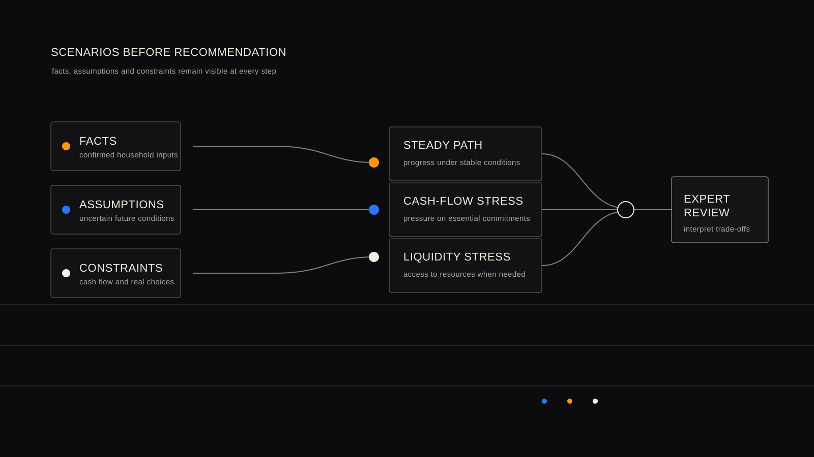

# Before a Recommendation: Why Financial Planning Starts with Scenarios

[简体中文](scenarios-before-recommendation.zh-CN.md)

Financial planning is often phrased as a simple request: *What should I do now?* For a household balancing retirement, education, housing, protection, and family responsibilities, an early answer can hide the more important question: under which conditions does that answer hold, and under which conditions does it fail?

WhiteBox takes a public research view that planning should not begin with a recommendation. It should begin with scenarios.

## A Scenario Is Not a Forecast

A scenario is not a prediction of markets or family life. It is a clear, reviewable set of assumptions used to ask whether a plan remains coherent when conditions change. Lower-than-expected income growth, higher medical costs, earlier education spending, or illiquid property can each change the meaning of the same plan.

Before alternatives are compared, three kinds of information need to remain distinct:

- **Facts:** confirmed assets, liabilities, income, expenses, protection, goals, and family responsibilities.
- **Assumptions:** inflation, income changes, retirement timing, liquidity needs, and other uncertain conditions.
- **Constraints:** cash-flow capacity, solvency needs, product rules, household preferences, and real-world choices.

The distinction is practical. A number that depends on an assumption should not be presented as a fact. A path that works only when a constraint is ignored should not be presented as robust.

## Compare Resilience, Not a Single “Best” Answer

Once the boundaries are visible, planning can compare paths rather than merely select a headline outcome. The question is not only which path looks strongest under one set of inputs. It is also whether the household can sustain essential cash flow, whether the path relies too heavily on an unreviewed assumption, and whether there is room to adapt when responsibilities change.

This is the public meaning of a planner in WhiteBox’s work: organize goals, constraints, and trade-offs into comparable scenarios before calculation, explanation, and review. It does not promise a single certain future. Exploratory output should not be presented as a formal conclusion.

## Fictional Composite Illustration: the Chen Household

> **Illustration only.** The Chen household is a fictional, de-identified composite created for public education. It contains no real client data and is not personal financial advice.

Mr. Chen and his spouse are in their forties. They have one school-age child, a home that represents a substantial share of household assets, ongoing mortgage and family-support responsibilities, and retirement goals that feel distant but important. Their income is currently stable, but a large part of their apparent financial strength is not immediately available as cash.

If planning began with a single recommendation, the family might receive a superficially clear answer: maintain the current saving pattern and add another long-term commitment. Scenario comparison asks more useful questions first.

| Scenario | Assumption under review | Planning question |
|---|---|---|
| Steady path | Income and expenses remain broadly stable | Can current goals progress without reducing the liquidity buffer below a reasonable level? |
| Cash-flow stress | Income is temporarily lower while education or family costs rise | Which commitments remain essential, and which ones can be adjusted without creating a shortfall? |
| Property-liquidity stress | Home value remains meaningful but cannot be converted to cash quickly | Does the household have enough accessible resources for a near-term need without relying on a sale? |

None of these paths predicts what will happen. Together, they reveal a trade-off that a single answer can miss: the family’s balance sheet may look strong while its near-term flexibility is limited. That insight does not automatically determine an action. It identifies the assumptions and priorities that deserve professional review.

## Expert Review Remains Essential

Scenario comparison supports judgment; it does not replace it. A financial-planning professional can examine whether the assumptions are reasonable, whether relevant obligations have been omitted, and whether a conclusion is suitable for formal guidance. A household can then understand not only a possible direction, but also the conditions and trade-offs behind it.

This matters especially in mainland China, where many households face a combination of property-heavy balance sheets, intergenerational support, education commitments, protection needs, retirement-income uncertainty, and liquidity pressure. Apparent wealth does not necessarily mean usable cash flow at a critical moment.

WhiteBox is being developed as an AI-native financial planning product shaped with local financial-planning, insurance, and household-advisory expertise. Its public research direction is to make planning more traceable, more discussable, and more honest about uncertainty.

This article is for public education and research discussion only. It is not personal financial advice.
