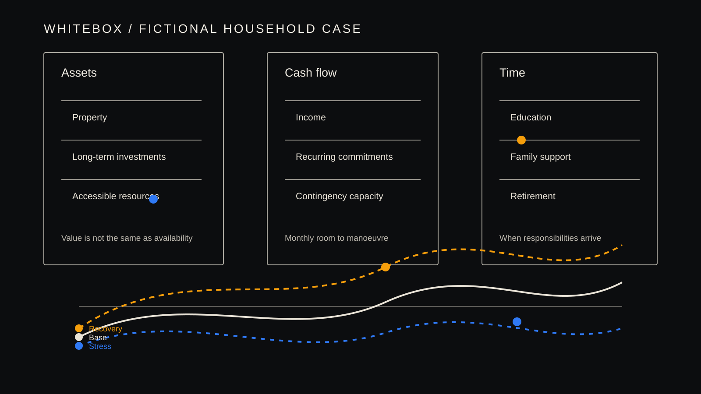

# 资产很多，为什么仍要看现金流与时间：一个虚构家庭的规划案例

[English](when-assets-are-not-enough.md)

本文使用完全虚构的案例，仅用于公共教育与研究讨论，不构成个人财务建议。

设想一个居住在中国大陆城市的三口之家：家庭拥有自住房和部分长期投资，收入目前稳定，同时面对子女教育、父母支持、按揭责任与退休准备。只看资产总额，家庭似乎拥有较大的选择空间。

但规划不应止于“资产有多少”。更关键的问题是：需要用钱的时间点是什么？资金是否能在需要时使用？一项长期承诺会不会削弱家庭应对短期变化的能力？

## 把资产、现金流与时间分开看

### 资产：家庭拥有什么，以及实际能动用什么

资产提供的是家庭资产负债表视角：家庭拥有什么、承担什么负债。这个视角很重要，但它只是起点。自住房可能具有显著价值，却未必适合或能够在短期内出售；长期投资的价值可能波动；保险相关权益也可能需要结合具体条件理解。一项资产可以对长期安全感很重要，却不一定适合用来承担一项立即到期的责任。

因此，有用的复核问题不只是“这个家庭有多少资产”，而是“哪些资源能够动用、在什么条件下动用、服务于什么规划目的”。把这些问题分开，有助于避免把资产负债表上的每一项都当成可以相互替代的现金。

### 现金流：家庭每个月可以持续承担什么

现金流描述的是资金如何随时间流入和流出家庭。收入只是其中一部分；日常开支、按揭、保费、教育支出、税费、家庭支持和其他承诺构成另一部分。即使账面资产较多，如果经常性责任占用了大部分可靠收入，家庭的可用空间仍然可能有限。

因此，现金流复核不能只看年度合计。它还要讨论收入是稳定还是波动、支出是可以调整还是具有刚性，以及短期变化发生时是否仍有能力覆盖日常生活与已知责任。目的不是给出一个唯一“正确”的缓冲数字，而是让韧性所依赖的假设清楚呈现，并能进入专业讨论。

### 时间：责任与选择何时到来

时间赋予资产和现金流实际含义。退休目标可能在数十年之后，而教育付款、按揭调整或家庭支持需求可能更早到来。即使资产和收入相同，责任发生的先后顺序不同，也会让两个家庭承受完全不同的规划压力。

时间还会影响家庭恢复的空间。当没有重大付款到期时，短暂的收入中断可能可以承受；若它恰好与一笔集中支出重合，压力就会明显增加。观察各项承诺的时间顺序，有助于专业人士区分长期目标与近期责任，并检验家庭能否在不依赖未经复核假设的情况下兼顾两者。

资产、现金流和时间彼此关联，但不应被压缩成一个数字。它们的相互作用，正是许多规划权衡变得可见的地方。

## 三个可比较情景

在基准情景中，收入保持稳定，教育支出按预期发生，长期目标看起来可承受。

在压力情景中，收入暂时下降，同时教育和家庭支持支出提前出现。此时，重点不再是账面资产是否充足，而是可动用资金能否覆盖近期责任。

在恢复情景中，收入逐步回稳，但家庭仍需评估先前承诺是否压缩了未来选择。恢复并不自动证明原计划稳健；它也可能说明家庭承受了过高的流动性压力。

## 专业复核应问什么

这个案例不提供行动建议。它提示专业人士明确区分已确认事实、待验证假设和不可忽略的约束，并讨论：

- 哪些资产可以在需要时合理动用？
- 哪些支出有明确的时间刚性？
- 家庭能否承受收入或市场环境的短期变化？
- 一项安排降低一种风险时，是否提高了另一种压力？

对于中国大陆家庭，房产集中、代际责任、教育投入、保障需求和退休收入不确定性可能同时存在。这个案例不是要把虚构家庭转化为建议，而是让需要专业复核的假设与权衡更加清晰。

WhiteBox 的公开研究方向，是让这些权衡更清楚、可追溯并可讨论。规划不是寻找一个看似正确的单一答案，而是在事实、假设、约束和不确定性之间进行专业复核。
